前端不同项目会使用不同 Node.js 版本，这里介绍，怎么用 Nvm for Windows 控制 Node.js 版本。

## 安装 Nvm

### 下载

- github: [https://github.com/coreybutler/nvm-windows/releases](https://github.com/coreybutler/nvm-windows/releases)

- 阿里云盘：[https://www.aliyundrive.com/s/MkXrpEw9FT8](https://www.aliyundrive.com/s/MkXrpEw9FT8)，提取码：a3a2

### 安装前

由于独立的 Node.js 和 Nvm for Windows 配置默认 Node.js 有冲突，如果本机上有独立安装 Node.js 需要先卸载。

如何干净的卸载？

1. 控制面板卸载。
2. “C:\Users\Administrator\AppData\Roaming”，删除用户对应路径下（npm、npm-cache、node 开头的文件夹）
3. 删除 Node.js 环境变量。

### 安装 Nvm

1. 运行下载好的 `nvm-setup.exe`， 同意协议，点击下一步

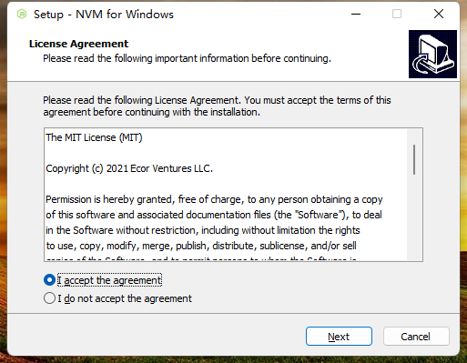

2. 该路径为 Nvm for Windows 的安装路径

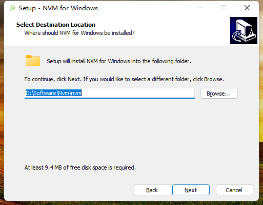

3. 该路径为 Nvm for Windows 选择 Node.js 版本的存放路径

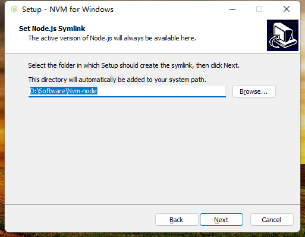

4. 点击 install，等待安装成功

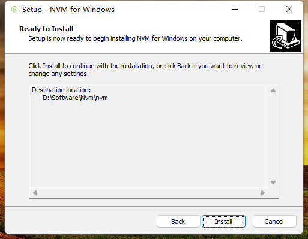

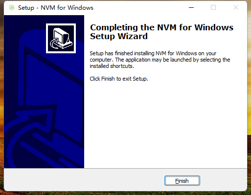

5. 安装成功后进入 cmd 命令行，输入 Nvm for Windows 命令查看是否安装成功，出现 Nvm for Windows 版本信息及为安装成功

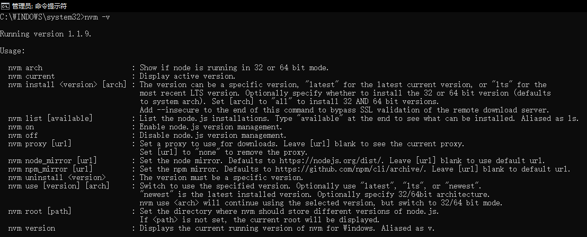

6. 安装成功后，在用户变量和系统变量中配置了两个变量 NVM_HOME 和 NVM_SYMLINK，分别指向 Nvm for Windows 和 Node.js 的存放目录，在系统 path 变量中配置了这两个参数

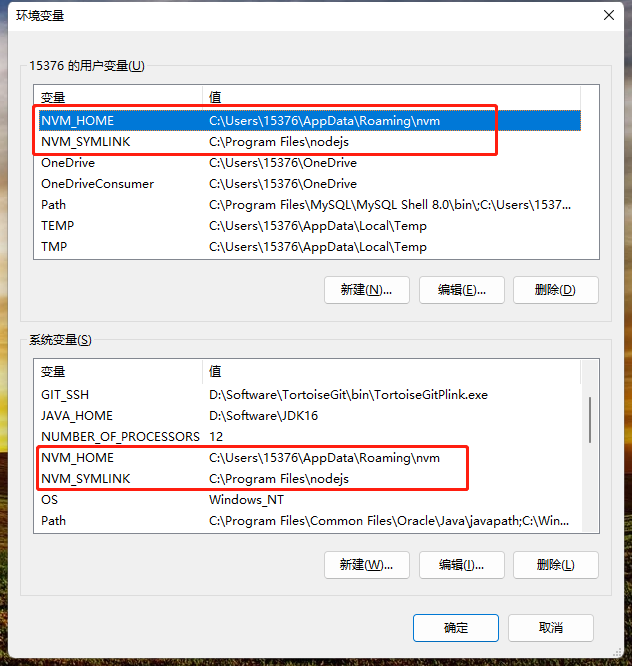

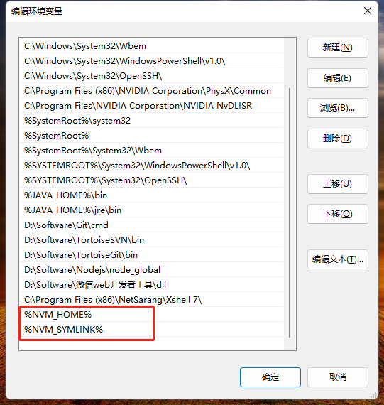

## 配置多版本 node

1. 可使用 `nvm list available` 命令查看 nvm 可安装的 Node.js 版本


2. 运行 `nvm install <version>`，安装指定的多个版本的 Node.js

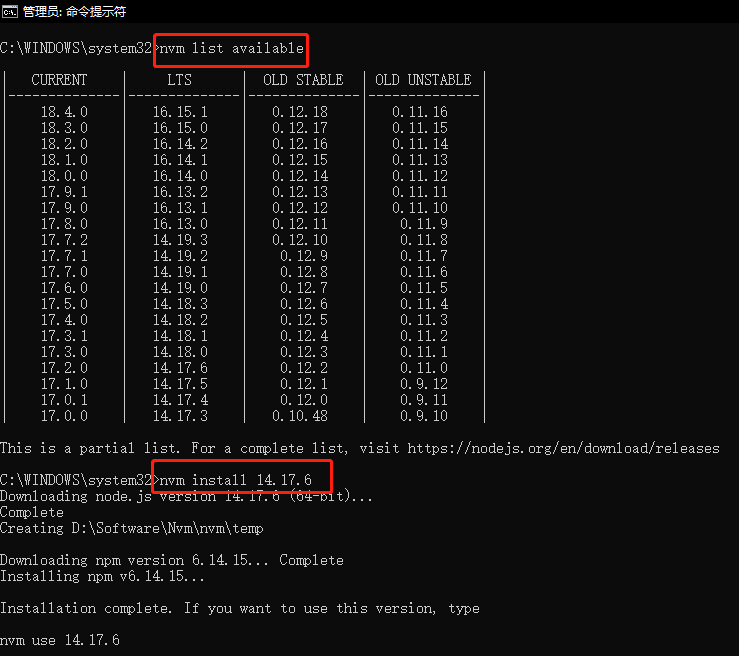

3. 管理员权限运行 `nvm use <version>`，切换 Node.js 版本

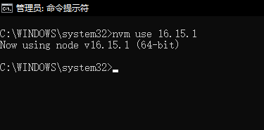

## 常用命令

```
// 查看目前已经安装的版本
nvm ls

// 安装指定的版本的 Node.js
nvm install 10.5.0

// 使用指定版本的 Node.js
nvm use 10.5.0

//显示可下载版本的部分列表
nvm list available

//删除已安装的指定版本，语法与 install 类似
nvm uninstall 10.5.0

//给不同的版本号添加别名
nvm alias

//删除已定义的别名
nvm unalias

//在当前版本 Node.js 环境下，重新全局安装指定版本号的 npm 包
nvm reinstall-packages <version>

//显示当前的版本
nvm current
```

## 常见问题

### 切换版本提示 exit status

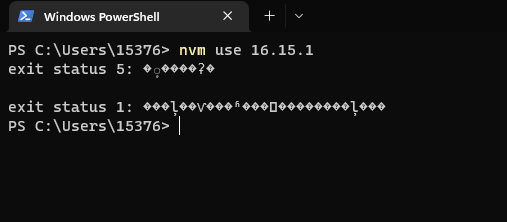

使用 nvm use 命令切换 Node.js 版本时，通常是没有复制删除文件夹权限导致,可使用管理员命令进行切换

解决方式：管理员运行 cmd

```
  nvm use version(版本号)
```

### node、npm 不是有效的命令

1. 检查一下 nvm 安装目录下是否有下载的 Node.js 版本，如果没有则需要重新下载。

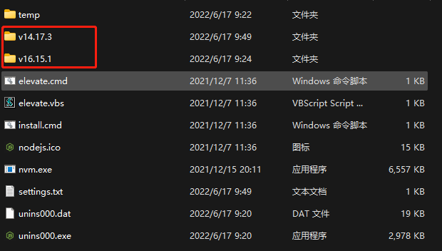

2. 将下载好的 Node.js 目录中的 npm 依赖包以及 `npm`、`npm.cmd`、`npx`、`npx.cmd` 复制一份，

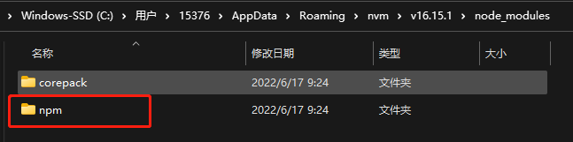

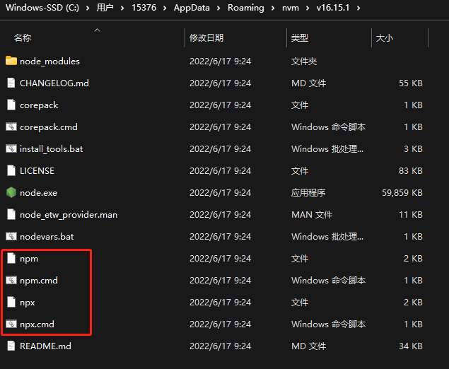

3. 找到 nvm 安装时配置的 Node.js 存放目录

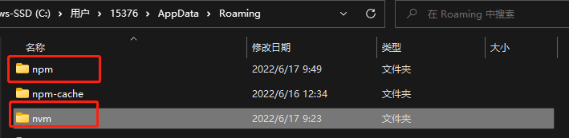

4. 将复制的 `npm`、`npm.cmd`、`npx`、`npx.cmd` 放在 Node.js 存放目录下，将复制的 npm 依赖包存放到 Node.js 存放目录里的 node_modules 目录下

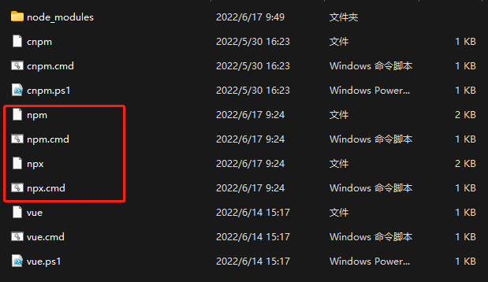

### Nvm for Windows 安装 Node.js 下载速度慢

添加以下内容到安装 Nvm for Windows 目录 settings.txt

```
node_mirror: https://npm.taobao.org/mirrors/node/
npm_mirror: https://npm.taobao.org/mirrors/npm/
```

此外提供了配置访问 Github 的几种方法，请移步[ 访问 Github ](../environment/github.md)
