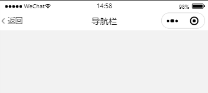

该文档记录了开发微信小程序项目（微信开发者工具，非跨端平台）中遇到的一些问题，例如：常用的自定义组件、常用的样式及函数、一些采坑的地方、常用业务的代码块等。

## 自定义组件

### 导航栏

特性：

- 该自定义导航栏均使用动态获取的参数，兼容性好，可扩展性高；

- 导航栏整体采用 fixed + absolute ，代码易维护/好理解；

- 可根据业务需要扩展不同的 properties；

- 自动计算插槽内容高度，防止引起导航栏塌陷；

效果图：



代码：

```html
<view class="navbar">
  <view
    class="navbar-fixed  {{borderBottom ? 'border-bottom':''}} {{bottomShadow ? 'bottom-shadow':''}}"
    style="background-color: {{backgroundColor}}; padding: {{navbarPaddingTop}}px {{navbarPaddingRight}}px {{navbarPaddingBottom}}px {{navbarPaddingLeft}}px;"
  >
    <view class="navbar-inner" style="height: {{navbarHeight}}px;">
      <view class="left" bindtap="goBack" style="top: {{navbarInnerTop}}px">
        <image style="width: {{backIconWidth}}; height: {{backIconHeight}};" wx:if="{{showBackIcon}}" src="{{backIcon}}"></image>
        <text wx:if="{{showBackText}}" style="line-height: {{navbarHeight}}px;color:{{backTextColor}};">{{backText}}</text>
      </view>
      <view class="title" style="width: calc(100% - {{menuWidth}}px - 30%);line-height: {{navbarHeight}}px;color:{{titleColor}};">{{title}}</view>
    </view>
    <view id="slot">
      <slot></slot>
    </view>
  </view>
  <view class="navbar-height" style="height:{{collapseHeight}}px;"></view>
</view>
```

```css
.navbar {
}

.navbar-fixed {
  width: 100vw;
  position: fixed;
  top: 0;
  left: 0;
  z-index: 9999;
  background-color: #fff;
}
.navbar-fixed.border-bottom {
  border-bottom: 1px solid #ddd;
}
.navbar-fixed.bottom-shadow {
  box-shadow: 0px 2px 6px 0px rgba(10, 52, 94, 0.08);
}
.navbar-inner {
  position: relative;
}
.left {
  position: absolute;
  min-width: 50rpx;
  height: 100%;
  transform: translate(0%, -50%);
  display: flex;
  align-items: center;
  padding-right: 20rpx;
  box-sizing: border-box;
}
.left text {
  font-size: 28rpx;
  font-family: PingFangSC-Medium, PingFang SC;
  font-weight: 500;
  color: #555;
}
.left image {
  width: 28rpx;
  height: 28rpx;
}
.title {
  height: 100%;
  text-align: center;
  position: absolute;
  top: 50%;
  left: 50%;
  transform: translate(-50%, -50%);
  font-size: 32rpx;
  font-family: PingFangSC-Medium, PingFang SC;
  font-weight: 500;
  color: #030303;
  overflow: hidden;
  white-space: nowrap;
  text-overflow: ellipsis;
}
```

```javascript
Component({
  properties: {
    title: {
      type: String,
      value: '导航栏',
    },
    backIcon: {
      type: String,
      value: 'https://s1.ax1x.com/2022/06/21/jS9Wzn.png',
    },
    showBackIcon: {
      type: Boolean,
      value: true,
    },
    borderBottom: {
      type: Boolean,
      value: true,
    },
    backText: {
      type: String,
      value: '返回',
    },
    slotHeight: {
      type: Number,
      value: 0,
    },
    showBackText: {
      type: Boolean,
      value: false,
    },
    titleColor: {
      type: String,
      value: '#030303',
    },
    backTextColor: {
      type: String,
      value: '#555',
    },
    backgroundColor: {
      type: String,
      value: '#fff',
    },
    backIconWidth: {
      type: String,
      value: '28rpx',
    },
    backIconHeight: {
      type: String,
      value: '28rpx',
    },
  },
  data: {
    navbarHeight: 0,
    navbarPaddingTop: 0,
    navbarPaddingBottom: 0,
    navbarPaddingLeft: 0,
    navbarPaddingRight: 0,
    menuWidth: 0,
    statusBarHeight: 0,
    navbarInnerTop: 0,
    collapseHeight: 0,
  },
  attached() {
    let $this = this
    const systemInfo = wx.getSystemInfoSync()
    const menuButtonInfo = wx.getMenuButtonBoundingClientRect()
    this.setData({
      navbarHeight: menuButtonInfo.height,
      menuWidth: menuButtonInfo.width,
      navbarPaddingTop: menuButtonInfo.top,
      navbarPaddingBottom: menuButtonInfo.top - systemInfo.statusBarHeight,
      navbarPaddingLeft: systemInfo.screenWidth - menuButtonInfo.right,
      navbarPaddingRight: systemInfo.screenWidth - menuButtonInfo.right,
      statusBarHeight: systemInfo.statusBarHeight,
      navbarInnerTop: menuButtonInfo.height / 2,
    })
    this.createSelectorQuery()
      .select('#slot')
      .boundingClientRect(function (res) {
        $this.setData({
          collapseHeight: $this.data.navbarPaddingTop + $this.data.navbarHeight + $this.data.navbarPaddingBottom + Number(res.height),
        })
      })
      .exec()
  },
  methods: {
    goBack() {
      wx.navigateBack({
        delta: 1,
      })
    },
  },
})
```

### 自由拖拽按钮

```html
<!-- btn.wxml -->
<view
  class="offer-btn"
  bindtap="goOfferList"
  catchtouchmove="buttonMove"
  bindtouchstart="buttonStart"
  bindtouchend="buttonEnd"
  style="top:{{buttonTop}}px;left:{{buttonLeft}}px;"
>
</view>
```

```css
/* btn.wxss */
.offer-btn {
  position: fixed;
  z-index: 991;
  bottom: 120rpx;
  right: 82rpx;
}
```

```javascript
// btn.js
var startPoint
Component({
  data: {
    buttonTop: 0,
    buttonLeft: 0,
    windowHeight: '',
    windowWidth: '',
  },
  attached() {
    let $this = this
    wx.getSystemInfo({
      success(res) {
        $this.setData({
          windowHeight: res.windowHeight,
          windowWidth: res.windowWidth,
          buttonTop: res.windowHeight * 0.8,
          buttonLeft: res.windowWidth * 0.8,
        })
      },
    })
  },
  methods: {
    buttonStart(e) {
      startPoint = e.touches[0]
    },
    buttonMove(e) {
      var endPoint = e.touches[e.touches.length - 1]
      var translateX = endPoint.clientX - startPoint.clientX
      var translateY = endPoint.clientY - startPoint.clientY
      startPoint = endPoint
      var buttonTop = this.data.buttonTop + translateY
      var buttonLeft = this.data.buttonLeft + translateX
      if (buttonLeft + 50 >= this.data.windowWidth) {
        buttonLeft = this.data.windowWidth - 50
      }
      if (buttonLeft <= 0) {
        buttonLeft = 0
      }
      if (buttonTop <= 0) {
        buttonTop = 0
      }
      if (buttonTop + 50 >= this.data.windowHeight) {
        buttonTop = this.data.windowHeight - 50
      }
      this.setData({
        buttonTop: buttonTop,
        buttonLeft: buttonLeft,
      })
    },
    buttonEnd(e) {},
  },
})
```

## 常用方法

### 父子组件消息传递

- 子组件通知父级组件

```javascript
// child.js
this.triggerEvent('close', {})
```

```html
<!-- father.js -->
<child-component bind:close="closeHandle"></child-component>
```

- 父组件向子组件传递数据

```javascript
// child.js
Component({
  properties: {
    title: {
      type: String,
      value: '',
    },
  },
})
```

```html
<!-- father.js -->
<child-component title="标题"></child-component>
```

- 父组件获取子组件实例

```html
<!-- father.wxml -->
<child-component id="childComponent"></child-component>
```

```javascript
// father.js
this.selectComponent('#childComponent').open()
```

### 引入计算属性

1. 构建 npm

```
npm init -y
```

2. 安装微信提供的计算属性依赖

```
npm install --save miniprogram-computed
```

3. 点击微信开发者工具上方工具栏的 工具/构建 npm/构建完成 点击确定即可

4. 引入计算属性

```javascript
const computedBehavior = require('miniprogram-computed').behavior

Page({
  // 这里注册引入的计算属性
  behaviors: [computedBehavior],
  data: {},
})
```

1. 使用 data 定义的数据

```javascript
const computedBehavior = require('miniprogram-computed').behavior
Page({
  behaviors: [computedBehavior],
  data: {
    a: 1,
  },
  computed: {
    fixed(data) {
      return data.a.toFixed(2)
    },
  },
})
```

6. 在计算属性中使用其他的计算属性

```javascript
const computedBehavior = require('miniprogram-computed').behavior
Page({
  behaviors: [computedBehavior],
  data: {
    a: 1,
  },
  computed: {
    fixed(data) {
      return data.a.toFixed(2)
    },
    unit(data) {
      return data.fixed + '元'
    },
  },
})
```

7. 在方法中使用其他的计算属性

```javascript
const computedBehavior = require('miniprogram-computed').behavior
Page({
  behaviors: [computedBehavior],
  data: {
    a: 1,
    b: '',
  },
  computed: {
    fixed(data) {
      return data.a.toFixed(2)
    },
  },
  addUnit() {
    this.setData({
      b: this.fixed + '元',
    })
  },
})
```

### 监听路由方法

```javascript
// 该方法没有记录在微信小程序开发文档中
wx.onAppRoute(res => {
  console.log(res)
})
```

### 简单的表单验证函数

函数代码：

```javascript
// validate.js
export const simpleValidate = (rules, form) => {
  return new Promise((resolve, rejct) => {
    let error = []
    for (const key in rules) {
      if (rules[key] && rules[key].required) {
        if (!form[key]) {
          error.push(rules[key].msg)
        } else {
          if (rules[key].validator) {
            try {
              rules[key].validator(form[key])
            } catch (err) {
              error.push(err.message)
            }
          }
        }
      }
    }
    if (error.length > 0) {
      wx.showToast({
        title: error[0],
        icon: 'none',
      })
      resolve(false)
    } else {
      resolve(true)
    }
  })
}
```

使用方法：

```javascript
const { simpleValidate } = require('./simple-validate')

Page({
  data: {
    form: {
      name: '',
      phone: '',
    },
    rules: {
      name: {
        required: true,
        msg: '名称不能为空',
      },
      phone: {
        required: true,
        msg: '手机号不能为空',
        validator: function (value) {
          if (!new RegExp(/^1(3\d|4[5-9]|5[0-35-9]|6[567]|7[0-8]|8\d|9[0-35-9])\d{8}$/).test(value)) {
            // new error 导出报错信息
            throw new Error('请输入格式正确的手机号')
          }
        },
      },
    },
  },
  submit() {
    simpleValidate(this.data.rules, this.data.form).then(validate => {
      if (validate) {
        // 通过验证
      }
    })
  },
})
```

## 常用的样式

### 自定义 check 组件样式

```css
checkbox .wx-checkbox-input {
  width: 32rpx;
  height: 32rpx;
  border-radius: 50%;
}

checkbox .wx-checkbox-input.wx-checkbox-input-checked {
  border-color: #005aa0;
  background: #005aa0;
}

checkbox .wx-checkbox-input.wx-checkbox-input-checked::before {
  width: 32rpx;
  height: 32rpx;
  line-height: 32rpx;
  border-radius: 50%;
  text-align: center;
  font-size: 32rpx;
  color: #fff;
  background: transparent;
  transform: translate(-50%, -50%) scale(1);
  -webkit-transform: translate(-50%, -50%) scale(1);
}
```

### 自定义 radio 组件样式

```css
wx-radio {
  -webkit-tap-highlight-color: transparent;
  display: inline-block;
}

wx-radio[hidden] {
  display: none;
}

wx-radio .wx-radio-wrapper {
  display: -webkit-inline-flex;
  display: inline-flex;
  -webkit-align-items: center;
  align-items: center;
  vertical-align: middle;
}

wx-radio .wx-radio-input {
  -webkit-appearance: none;
  appearance: none;
  margin-right: 5px;
  outline: 0;
  border: 1px solid #d1d1d1;
  background-color: #ffffff;
  border-radius: 50%;
  width: 22px;
  height: 22px;
  position: relative;
}

wx-radio .wx-radio-input.wx-radio-input-checked {
  background-color: #005aa0;
  border-color: #005aa0;
}

wx-radio .wx-radio-input.wx-radio-input-checked:before {
  font: normal normal normal 14px/1 'weui';
  content: '\EA08';
  color: #ffffff;
  font-size: 18px;
  position: absolute;
  top: 50%;
  left: 50%;
  transform: translate(-50%, -48%) scale(0.73);
  -webkit-transform: translate(-50%, -48%) scale(0.73);
}

wx-radio .wx-radio-input.wx-radio-input-disabled {
  background-color: #e1e1e1;
  border-color: #d1d1d1;
}

wx-radio .wx-radio-input.wx-radio-input-disabled.wx-radio-input-checked {
  background-color: #005aa0;
  border-color: #005aa0;
}

wx-radio .wx-radio-input.wx-radio-input-disabled:before {
  color: #fff;
}

wx-radio-group {
  display: block;
}

wx-radio-group[hidden] {
  display: none;
}
```

## 采坑

### 字体下载

- 字体包的 url 必须使用 https

- 如遇下载失败，大部分是因为地址没有开启跨域，小程序下载字体不会提示跨域，需要新增 `.html` 文件引入 url 字体测试

示例代码：

```javascript
wx.loadFontFace({
  global: true,
  family: 'PangMenZhengDao',
  source: 'url("https://xxxxx/font.ttf")',
  success(res) {},
  error(err) {},
})
```

### 背景图片

- `background-image:url();` 不能使用本地图片、图片 url 带中文或者空格；

- base64 虽然可以使用，但是体积较大，不建议使用；

以下写法背景图不显示：

```css
background-image: url(https://xxxx/图片.png);
```

### 在 wxml 中使用函数

1. 新建 `utils.wxs` 文件

```javascript
var formatUtils = {
  format: function format(val) {
    // 这里不能使用 es6 及以后的语法
    return val.toFixed(2)
  },
}

module.exports = {
  format: formatUtils.format,
}
```

2. 在 `page.wxml` 中顶层标签引入

```html
<wxs src="/utils/format.wxs" module="formatUtils"></wxs>
<view class="page">
  <text>{{formatUtils.format(1)}}</text>
</view>
```

### createSelectorQuery

```javascript
// 在页面中使用
wx.createSelectorQuery
  .select('#id')
  .boundingClientRect(function (res) {})
  .exec()

// 在自定义组件中使用
this.createSelectorQuery()
  .select('#id')
  .boundingClientRect(function (res) {})
  .exec()
```

selector 语法：

selector 类似于 CSS 的选择器，但仅支持下列语法。

- ID 选择器：#the-id
- class 选择器（可以连续指定多个）：.a-class.another-class
- 子元素选择器：.the-parent > .the-child
- 后代选择器：.the-ancestor .the-descendant
- 跨自定义组件的后代选择器：.the-ancestor >>> .the-descendant
- 多选择器的并集：#a-node, .some-other-nodes

### data-xxx 传值

data-xxx 传入的名称会强制变更为小写，如 `data-tagName` 在 `tapName` 方法中返回的 e 中显示为 `tagname`

```html
<view data-tagName="tag" data-index="0" bindtap="tapName"></view>
```

```javascript
tapName(e){
  console.log(e.currentTarget.dataset.tagname)
}
```
